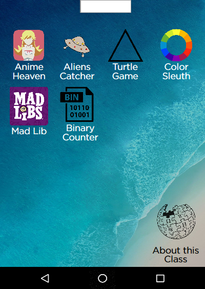

## Computer Science Course Catalogue App
Built using [code.org][code dot org] & alot of fun free time

[code dot org]: https://code.org/

 

## Our to do List
- [X] Bug Free
- [X] Stright to the Point
- [ ] Approved

### Screenshots

